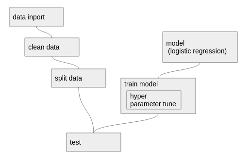
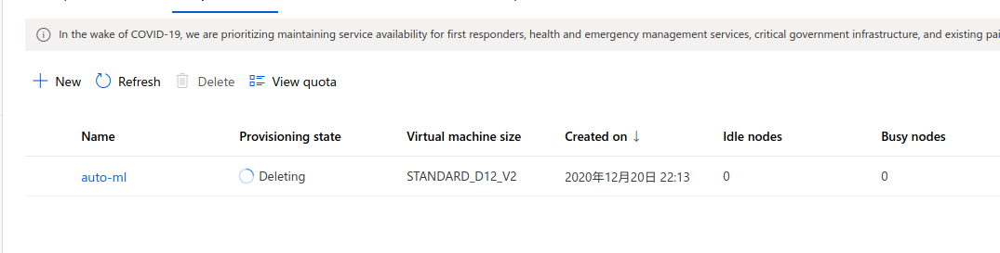

#Optimizing an ML Pipeline in Azure

## Overview
This project is part of the Udacity Azure ML Nanodegree.
In this project, we build and optimize an Azure ML pipeline using the Python SDK and a provided Scikit-learn model.
This model is then compared to an Azure AutoML run.

## Summary
**In 1-2 sentences, explain the problem statement: e.g "This dataset contains data about ... we seek to predict ..."**  
This data set is the result of a direct marketing campaign on bank time deposits.
It contains about 20 information such as age, work, family structure, and information on whether or not you have purchased a time deposit. This project predicts whether or not to contract a fixed deposit from the attribute information of the customer.

**In 1-2 sentences, explain the solution: e.g. "The best performing model was a ..."**  
Logistic regression AUC is 0.92. The calculation time was 10 minutes, the AutoML AUC was 0.95, and the calculation time was 43 minutes. AutoML has tried 86 estimators to find the best Voting Ensemble.　Reducing the calculation time of AutoML is a problem that can be avoided to some extent by cluster configuration. It can be said that AutoML (VotingEnsemble), which has excellent accuracy, is the best.

## Scikit-learn Pipeline
**Explain the pipeline architecture, including data, hyperparameter tuning, and classification algorithm.**  

  
The objective variable y is set to continue or not to keep the time deposit, and other data is used as the explanatory variable. The explanatory variables are subjected to One Hot encoding according to the item and divided into training data and test data. The esthetic meter employs logistic regression.
Of the parameters of logistic regression, two parameters, regularization "C" and maximum number of searches for optimization search max_iter, are tuned with HyperDride. Regularization is a method of applying a penalty to suppress overfitting, and C is the strength of regularization. The smaller the value, the stronger the regularization (it becomes difficult to make a complicated model)

**What are the benefits of the parameter sampler you chose?**  
Random sampling is used as the hyperparameter search method. 
This option randomly selects a parameter value from a system-defined range. You must specify the maximum number of runs that the module will run. This is useful if you want to save computing resources while using selected metrics to improve model performance.

**What are the benefits of the early stopping policy you chose?**  
Poor performance executions are truncated early by the early termination policy. Adopt a bandit policy for more aggressive savings.
The adopted policy setting starts at evaluation interval 5 and the early termination policy is applied every interval when the metric is reported. All runs with the best metric less than (1 / (1 + 0.1) or less than 91% of the best performing runs are terminated.

## AutoML
**In 1-2 sentences, describe the model and hyperparameters generated by AutoML**  
　AutoML has tried 86 estimators to find the best Voting Ensemble
 Ensemble learning improves machine learning results and predictive performance by combining multiple models as opposed to using single models. The ensemble iterations appear as the final iterations of your run. VotingEnsemble　predicts based on the weighted average of predicted class probabilities 

Multiple models contain eight classifiers such as parameter-tuned xgboostclassifier and lightgbmclassifier, which are output by load averaging of these outputs. The weight is expressed as follows.

## Pipeline comparison
**Compare the two models and their performance. What are the differences in accuracy? In architecture? If there was a difference, why do you think there was one?**  
One is to get the best performance of logistic regression by tuning hyperparameters.
AutoML tries multiple patterns of combinations of data processing methods and classifiers, and selects the best classifier with good features. Since the data is unbalanced, it is appropriate to evaluate the metrics with AUC. Logistic regression of AUC is 0.92, AuoML is 0.95, and AutoML is excellent.

## Future work
**What are some areas of improvement for future experiments? Why might these improvements help the model?**  
For AutoML to avoid overfits, consider the following 
- Use more training data and eliminate statistical bias
- Prevent target leakage
- Reduction of functions used
(Data bias is improved by AutoML weight column)

For custom scikit-learn pipeline, to avoid overfitting It will be considered.
- Use more training data and eliminate statistical bias
- Prevent target leakage
- Reduction of functions used
- Cross-validation  

In addition, try hyperparameter tune with classifiers other than logistic regression such as Xgboost and SVM. It also requires upsampling to eliminate imbalanced data.

## Proof of cluster clean up
**If you did not delete your compute cluster in the code, please complete this section. Otherwise, delete this section.** 
**Image of cluster marked for deletion**   
